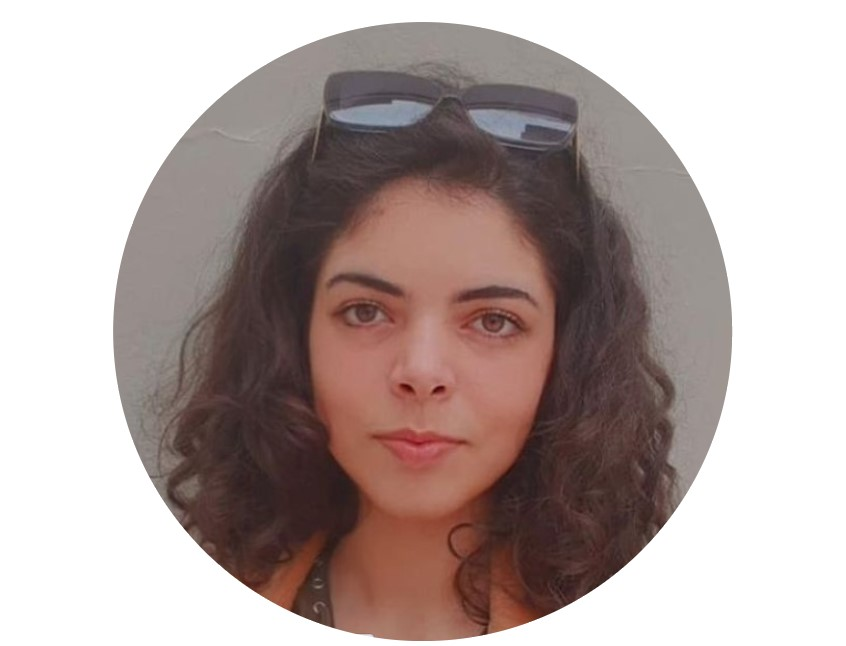
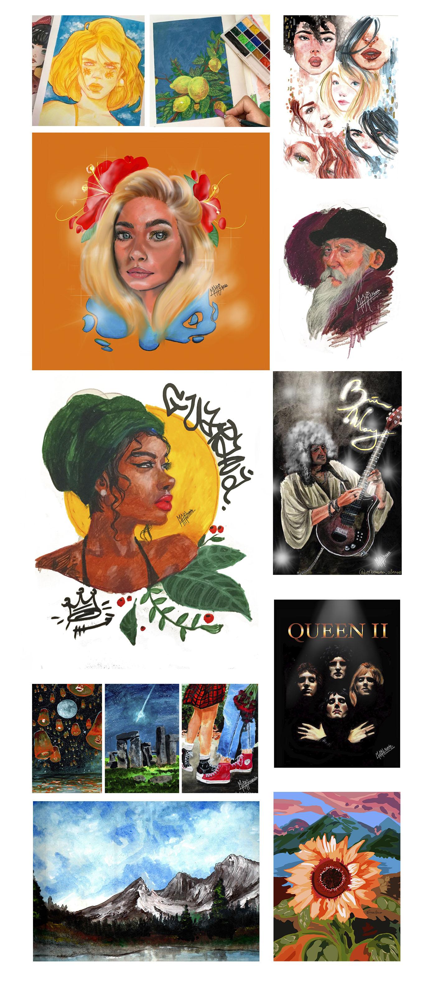

<html lang="pt-br">
<head>
</head>
<body>
    

        
    

       <h1 style="text-align:center;"> Mariana Abraão</h1>
 

       <h5 style="text-align:center;">Design, Pintura e Artes Visuais</h5>

<h5 style="text-align: center;">marianabarbosaabraao@gmail.com @mariana_abraao (+55)11 96747-0206</h5>
<h5 style="text-align: center;">Pintora de "live art" e desenhista, trabalhando como <i>freelancer</i> no momento, mas sempre em busca de mais experiências e conhecimento profissional.
     Cursando Design na Universidade Presbiteriana Mackenzie e 
     Artes Visuais na Universidade Paulista (UNIP).</h5>
<h3 style="text-align: center;"><b>Escolaridade:</b></h3>
<h5 style="text-align: center;">
Colégio Dona Leonor Mendes de Barros 
Concluído em 2018
</h5>

<h3 style="text-align: center;"><b>Experiência:</b></h3>

<ul>
    <li>Experiência internacional no ano de 2018, em uma semana imersiva na cultura Norte Americana no acampamento Word of Life Flórida, mais uma semana de passeio túristico pelo estado. </li>
    <li>Ilustrações para aulas de Cosmovisão reformada no Mackenzie.</li>
    <li>Apresentação de cinco quadros em "live arte" na Igreja Presbiteriana de Vila Mariana (IPVM) como convidada.</li>
    <li>Designer das publicidades e site do acampamento ABU Mackenzie de 2020, que foi adiado por conta da pandemia do COVID-19. </li>
    <li>Líder de decoração e líder de quarto de crianças, adolescentes e jovens dos 4 a 18 anos no mês de Julho de 2019, e no mês de Janeiro de 2020, no acampamento Recanto Presbiteriano.</li>
    <li>Estagiária na empresa Júnior Mackenzie de design, durante o segundo semestre de 2019.</li>
    <li>Curso: "Visual Elements of User Interface Design" concluído em 2020, oferecido pela California Institute of the Arts (CALARTS).</li>
    <li>Curso: "Course Certificate for Modern Art & Ideas" concluído em 2020, oferecido pelo MoMA, NY.</li>
    <li>Curso intermediário de piano e violino. </li>
</ul>

<h3 style="text-align: center;"><b>Skills:</b></h3>

<ul>
    <li>Adobe Photoshop e Gimp;</li>
    <li>Adobe Illustrator;</li>
    <li>Adobe Premiere e Filmora9;</li>
    <li>Rhino;</li>
    <li>AutoCad;</li>
    <li>Autodesk SketchBook;</li>
    <li>Modelagem em massas variadas, como: cerâmica, plastilina, massa de EVA, gesso, argila branca e vermelha;</li>
    <li>Desenho técnico;</li>
    <li>Desenho anatômico;</li>
    <li>Pintura com: aquarela, tinta spray, tinta acrílica e tinta com base de óleo, podendo ser aplicadas tanto em telas, como papeis e paredes;</li>
    <li>Escrita e leitura de partituras musicais, cifras e tablaturas;</li>
    <li>Caligrafia;</li>
    <li>Fotografia.</li>
</ul>

<h3 style="text-align: center;"><b>Alguns Trabalhos:</b></h3>

<h3 style="text-align: center;"><b>Para mais informações:</b> 
<a href="https://www.instagram.com/mariana_abraao/?hl=pt-br">Instagram</a> 
<a href="https://www.behance.net/marianabard393">Behance</a> 
<a href="https://www.linkedin.com/in/mariana-abra%C3%A3o-786423194/">Linkedin</a></h3>

</body>
</html>
